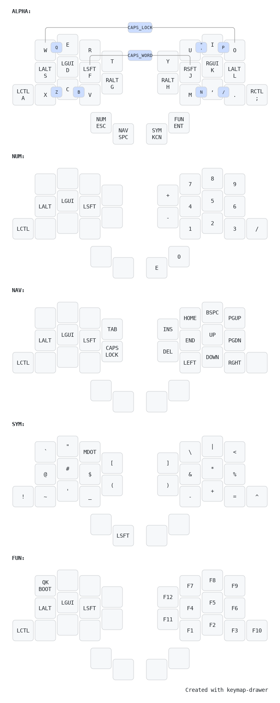

# Keymap

## How to generate

Generated with [keymap drawer](https://keymap-drawer.streamlit.app/).

To update, use the `keymap.yaml` file in keymap drawer editor and override the layout with the `keyboard.json`.

An initial `keymap.json` was generated from the QMK `keymap.c` file using the following commamd:

    qmk c2json --no-cpp -kb zilpzalp -km default -o keymap.json

This was then loaded as a QMK keymap to parse an initial `keymap.yaml` file from.
